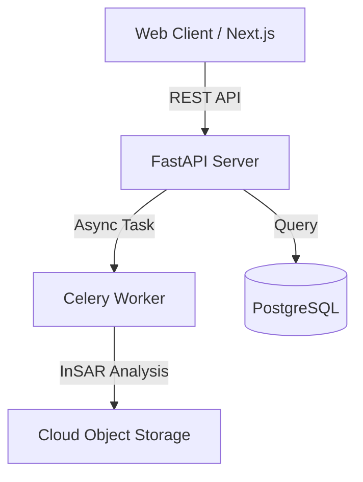

# エンジニアポートフォリオサイト 刷新基本設計書

## 1. プロジェクト概要・刷新方針

### 1.1 目的
- **エンジニア就活・実務選考における通過率の最大化**
- 面接官・テックリードが「30秒で技術スタック・設計能力・課題解決力」を把握できる情報設計の実現
- 「AI生成テンプレート感」「描画遅延」「保守の煩雑さ」の根本解決

### 1.2 刷新の基本方針
| 項目 | 従来（課題） | 刷新後（方針） |
|---|---|---|
| **デザイン** | ネオン発光・過度なアニメーション（AIテンプレ風） | **引き算のミニマルデザイン**（白/黒/グレー、規律ある余白・タイポグラフィ） |
| **表示速度** | 重いJSやクライアント描画による遅延 | **Zero-JS / SSG配信**（Core Web Vitals 最適化、Lighthouse 95+） |
| **コンテンツ** | 技術タグとスクショのみの薄いカード | **「課題（Why）」「技術選定理由」「アーキテクチャ」**を言語化したレポート構成 |
| **保守性** | JSX内へのテキストベタ書き | **データ・Markdown（MDX）とUIの完全分離** |

---

## 2. システム・技術アーキテクチャ

### 2.1 推奨技術スタック
静的サイトとしての高速配信と型安全なコンテンツ保守を両立するため、**Astro または Next.js (App Router / Static Export)** を採用する。

- **Framework**: Astro (推奨 / Zero-JS Islands) または Next.js (App Router, RSC中心)
- **Styling**: Tailwind CSS
- **Typography / Icons**: Geist Sans / Inter, Lucide React (または SVG直埋め)
- **Content Management**: Astro Content Collections または MDX (TypeScript Zod スキーマ検証)
- **Hosting / CDN**: Cloudflare Pages または Vercel
- **Diagrams**: Mermaid.js (ビルド時SVG変換)

### 2.2 ディレクトリ構成（コンテンツ分離設計）
```text
src/
├── content/                     # ★更新頻度の高いデータを集約
│   ├── projects/                # プロジェクト詳細記事 (.mdx)
│   │   ├── satellite-insar.mdx
│   │   └── rag-knowledge-base.mdx
│   └── resume.ts                # プロフィール・経歴・スキルの型定義データ
├── components/                  # 再利用可能なUIパーツ
│   ├── common/                  # Header, Footer, Container
│   ├── sections/                # Hero, About, ProjectsList, Experience
│   └── ui/                      # Badge, Button, ProjectCard
├── layouts/
│   └── BaseLayout.astro
└── pages/
    ├── index.astro              # トップページ（1カラム要約）
    └── projects/
        └── [slug].astro         # プロジェクト詳細ドキュメントページ
```

---

## 3. 画面設計・情報構造（Information Architecture）

サイト幅は **`max-w-2xl` 〜 `max-w-3xl`（約650px〜768px）** の中央1カラム構成とし、ドキュメントのように上から下へストレスなく読ませる。

### 3.1 ページ構成

```
┌────────────────────────────────────────────────────────┐
│ [1. Hero / Header]                                     │
│   氏名 / 所属（専攻） / コア領域 (例: Backend / CS)    │
│   Links: GitHub | X | Mail | Resume(PDF)               │
├────────────────────────────────────────────────────────┤
│ [2. About]                                             │
│   専門領域・研究テーマ・興味のある技術（3〜4行要約）   │
├────────────────────────────────────────────────────────┤
│ [3. Featured Projects] ★最重要セクション (2〜3件厳選) │
│   ┌──────────────────────────────────────────────────┐ │
│   │ Project Name (2025 - 2026)                       │ │
│   │ ・概要: 解決した課題と機能の要約 (1行)           │ │
│   │ ・技術: Python, FastAPI, Docker, PostgreSQL      │ │
│   │ ・成果/工夫: 処理時間40%削減、非同期化設計       │ │
│   │ [Live Demo] [GitHub Code] [技術解説を読む →]     │ │
│   └──────────────────────────────────────────────────┘ │
├────────────────────────────────────────────────────────┤
│ [4. Technical Skills]                                  │
│   ※星評価は全廃。実務・研究での使用実績順に分類        │
│   ・Languages: Python, TypeScript, SQL                 │
│   ・Frameworks/Libraries: FastAPI, Next.js, PyTorch   │
│   ・Cloud / Infra: Docker, Azure, Linux, Git           │
├────────────────────────────────────────────────────────┤
│ [5. Experience & Education]                            │
│   タイムライン形式（大学院、学士、インターン、発表歴） │
└────────────────────────────────────────────────────────┘
```

---

## 4. プロジェクト詳細（MDX）の記述フォーマット

各プロジェクトの詳細ページ（またはGitHubのREADME）は、以下の構成で記述する。面接官が確認したい「思考プロセス」を先回りして提示する。

```markdown
# [プロジェクト名]

## 1. 概要 & 解決したい課題 (Why)
- **背景**: どのような課題や不便が存在していたか
- **目的**: 誰の、どんな問題を解決するために開発したか
- **デモ**: [WebサイトURL] / [デモGIF画像]

## 2. システムアーキテクチャ


## 3. 技術選定とトレードオフ
| 採用技術 | 検討した代替技術 | 選定理由（トレードオフ） |
|---|---|---|
| FastAPI | Django, Flask | 非同期I/Oの親和性と型ヒントによる保守性、自動OpenAPIドキュメント生成を評価 |
| PostgreSQL | MongoDB | 空間データ（PostGIS）の利用要件とトランザクション整合性を優先 |

## 4. 技術的な課題と解決プロセス (Engineering Challenges)
- **課題1**: 大規模データの処理時にレスポンスがタイムアウトする
  - **原因**: 同期処理によるスレッドブロック
  - **解決策**: Celery + Redisによるバックグラウンドキュー化と進捗ポーリングの導入により、UIの応答性を維持
```

---

## 5. デザインシステム規律（脱AIテンプレ化ガイドライン）

1. **カラーパレットの制限**
   - 背景: `zinc-50` (Light) / `zinc-950` (Dark)
   - 本文文字: `zinc-800` (Light) / `zinc-200` (Dark)
   - サブ文字: `zinc-500` (Light) / `zinc-400` (Dark)
   - 境界線: `border-zinc-200` (Light) / `border-zinc-800` (Dark)
   - アクセントカラー: 原則1色のみ（例: 落ち着いたブルーまたはインディゴ）。ネオンカラーや過剰なグラデーションは使用しない。
2. **タイポグラフィ**
   - 見出しと本文の階層（Size & Weight）を厳格化。
   - コードブロックや技術タグには等幅フォント（JetBrains Mono / Fira Code）を指定。
3. **アニメーションの抑制**
   - ページ遷移時の重いフェードや3D回転は廃止。
   - ホバー時のわずかな背景色変化（`transition-colors duration-150`）程度に留める。

---

## 6. パフォーマンス・SEO・品質目標

- **Core Web Vitals 目標値**:
  - LCP (Largest Contentful Paint): 1.2秒未満
  - FID / INP: 50ms未満
  - CLS (Cumulative Layout Shift): 0
- **Lighthouse スコア**:
  - Performance: 95以上
  - Accessibility: 100
  - Best Practices: 100
  - SEO: 100
- **ソーシャルシェア (OGP)**:
  - ページごとにタイトルと概要が含まれる動的OGP画像を生成。